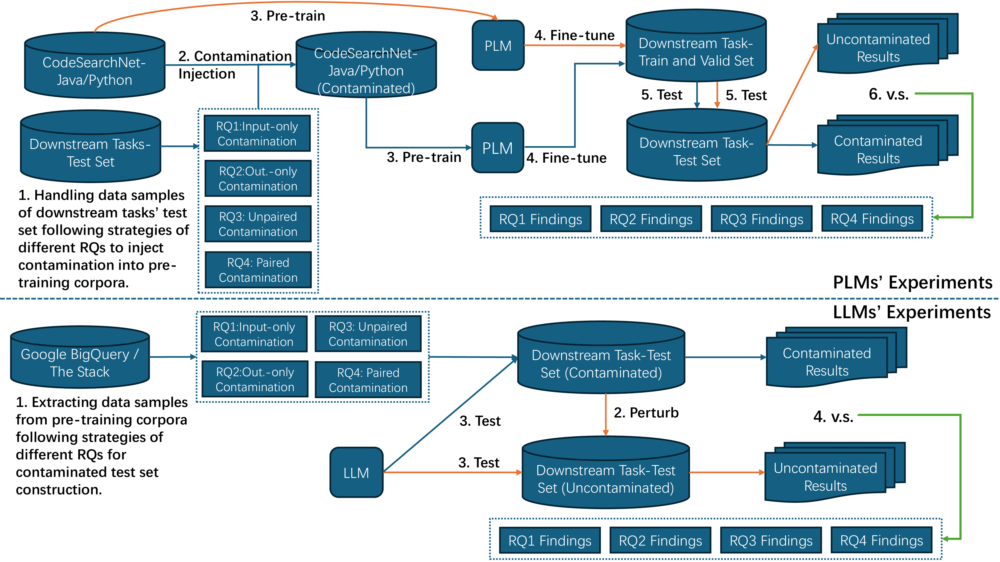
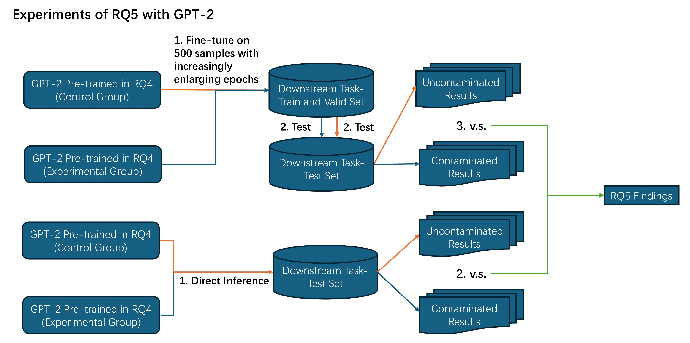

# Contamination Means Overestimation? A Comprehensive Empirical Study in Code Intelligence

## Experimental Procedure


## Prompt
Here is the prompt we used for large language model inference, along with a one-shot example.

Code Translation:
```
# Java->C#

Please translate the following Java function into equivalent C# code. End your answer with 'END OF CASE'.
Java:
private void injectBundleContext(BundleContext bundleContext) {
    this.bundleContext = bundleContext;
    this.resourceLoader = new OsgiBundleResourceLoader(bundleContext.getBundle());
}         
C#:
private void InjectBundleContext(BundleContext bundleContext) {
    this.bundleContext = bundleContext;
    this.resourceLoader = new OsgiBundleResourceLoader(bundleContext.getBundle());
}
END OF CASE
Java:
{entry['Java_function']}
C#:
```
```
# Python->jJava

Please translate the following Python code into equivalent Java code. End your answer with 'END OF CASE'.
Python:
class Counter:
    def __init__(self):
        self.count = 0
    def increment(self, delta):
        self.count += delta
        return self.count
Java:
public class Counter {{
    private int count;
    public Counter() {{
        this.count = 0;
    }}
    public int increment(int delta) {{
        this.count += delta;
        return this.count;
    }}
}}
END OF CASE

Python code:
{entry['question']}
Java code:
```


Code Summarization:
```
# Java->NL
Please summarize the following Java function. End your answer with 'END OF CASE'.
Function:
private void injectBundleContext(BundleContext bundleContext) {
    this.bundleContext = bundleContext; this.resourceLoader = new OsgiBundleResourceLoader(bundleContext.getBundle());
}
Summary:
This Java function injects a `BundleContext` object, stores it, and initializes a `ResourceLoader` with the associated bundle.
END OF CASE
Function:
{entry['Function']}
Summary:
```
```
# Python>NL
Please summarize the following Java function to natural language. End your answer with 'END OF CASE'.
        Function:
        public boolean saveConfig(Map<String, Object> data, String filename) {{
            try (FileWriter writer = new FileWriter(filename)) {{
                new Gson().toJson(data, writer);
                return true;
            }} catch (IOException e) {{
                return false;
            }}
        }}
        Summary:
        This function writes a map of configuration data to a JSON file and returns whether the save operation was successful.
        END OF CASE

        Java function:
        {entry['question']}
        Natural language:
```

Code Generation:
```
# NL->Java

Please implement the following Java function. End your answer with 'END OF CASE'.
Instruction:
Write a Java method that sets a `name` field to the provided parameter value.
Function:
public void setName(String name) {
    this.name = name;
}
END OF CASE
Instruction:
{entry['Instruction']}
Function:
```
```
# NL->Python
Please implement the Python function based on the description. End your answer with 'END OF CASE'.

Description:
Write a procedure, clamp, which takes two integers, x and limit, and returns x if x is between -limit and limit, otherwise returns the nearest of -limit or limit.

Function:
def clamp(x, limit): 
    if x < -limit: 
        return -limit 
    elif x > limit: 
        return limit 
    else: 
        return x
END OF CASE

Description:
{entry['question']}

Python function:

```

## Complete Result

Please refer to the [result](./result.md) for the complete experimental results

## Pretrained Model
The Java data used for pretraining can be obtained from [CodeSearchNet](https://huggingface.co/datasets/code-search-net/code_search_net/blob/main/data/java.zip). The dataset for the code translation task is available at [CodeTrans](https://github.com/microsoft/CodeXGLUE/tree/main/Code-Code/code-to-code-trans/data), and the dataset for the code generation task can be found at [Concode](https://github.com/microsoft/CodeXGLUE/tree/main/Text-Code/text-to-code/dataset/concode). For convenience, all datasets can also be found directly in the [dataset](./dataset) folder.


#### RoBERTa-base

Run `pretrain.sh` to perform model pretraining:
```shell
cd roberta/
bash pretrain.sh
```
Use the pretrained model for fine-tuning on downstream tasks and evaluate it on the test set:
```shell
bash run.sh
bash score.sh
```
Conduct further evaluation using eval_plm.py
```shell
python eval_plm.py
```


#### GPT2-small

Pre-training and fine-tuning code for different languages and different code-related tasks can be found in the gpt2 directory. You only need to point the dataset to your local dataset. Taking the GPT-2 Python-to-Java translation task as an example.
```shell
cd gpt2/python/code_translation
python pretrain_python2java.py
python fine_python2java.py
```
Conduct further evaluation using infer.py and eval.py
```shell
cd gpt2/python/code_translation
python infer_python2java.py
python eval_python2java.py
```

## Large Language Model

### Data construction
The Java and C# data used in StarCoder's pretraining can be obtained from [bigcode/the-stack](https://huggingface.co/datasets/bigcode/the-stack), while the Java and C# data used in LLaMA's pretraining can be accessed via [bigquery](https://console.cloud.google.com/bigquery?ws=!1m4!1m3!3m2!1sbigquery-public-data!2sgithub_repos).


When extracting unpaired code translation datasets, use the following function to obtain the results.
```shell
cd extract_data
python filter-unpaired.py
python match-unpaired.py
```
When extracting paired code summarization datasets, use the following function to obtain the results.
```shell
cd extract_data
python extract_paired-summary.py
```
When extracting paired code generation datasets, use the following function to obtain the results.
```shell
cd extract_data
python extravt-paired-generation.py
```

We have provided samples in the [dataset](./dataset)

### Infer

The large models used for inference are obtained from [Starcoder](https://huggingface.co/bigcode/starcoderbase) and [Llama](https://huggingface.co/alexl83/LLaMA-33B-HF). You can perform inference using `infer.py`; simply replace the prompt and the corresponding model as needed.
```shell
cd llama/python
python infer_translation.py
```
use eval_llm.py for evaluation
```shell
cd llama/python
python clean_translation.py
python eval_translation.py
```


