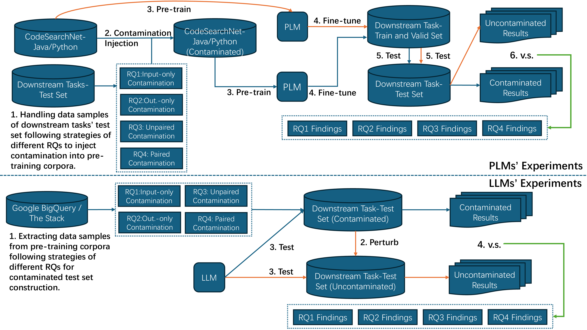
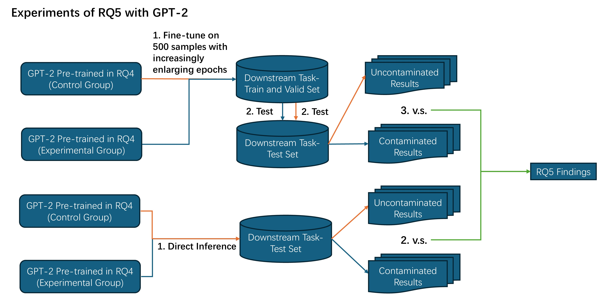
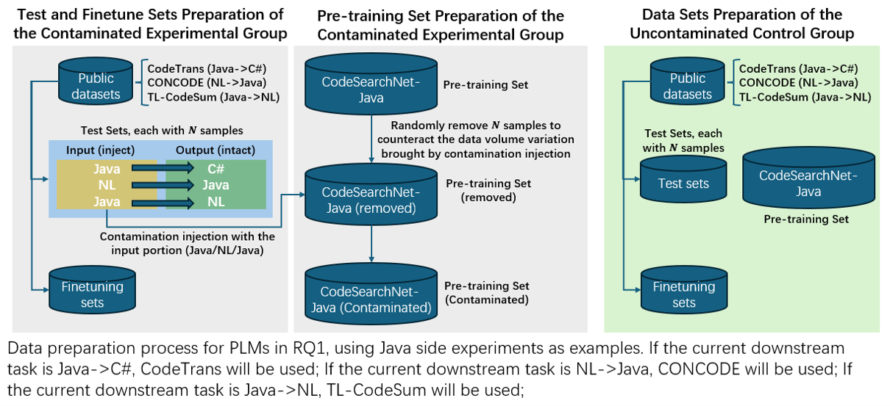
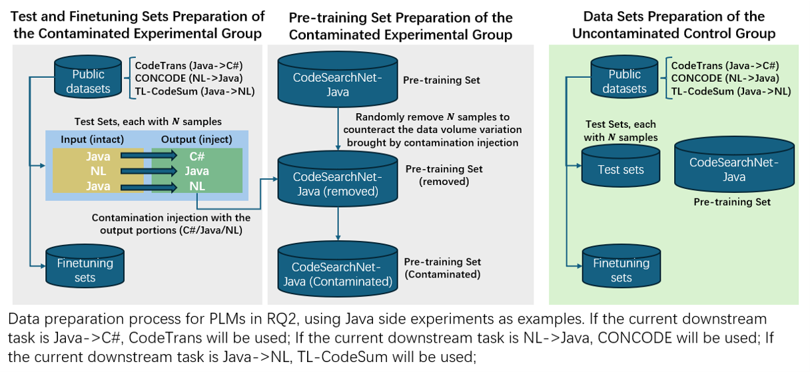
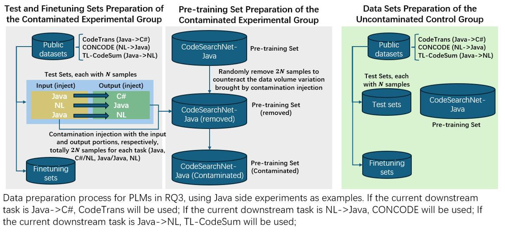
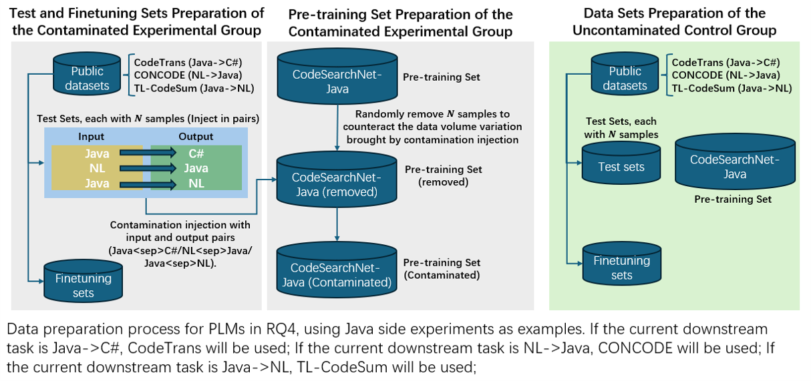
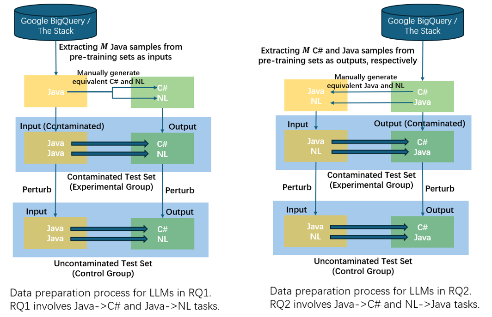
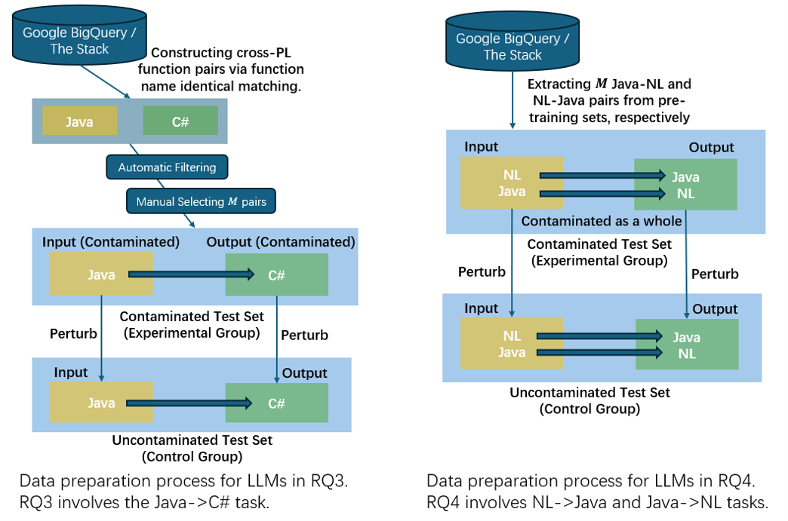

# Contamination Means Overestimation? A Fine-grained Empirical Study in Code Intelligence

## Experimental Procedure

Below is the research methodology overview for RQ1-RQ5, where the orange lines are procedures in the uncontaminated control groups, while the black lines are those in contaminated experimental groups.  



## Data Preparation

Here is our data preparation process for each RQ, including both the PLM part and the LLM part.








## Prompt

Here is the prompt we used for large language model inference, along with a one-shot example.

Code Translation:

```
# Java->C#

Please translate the following Java function into equivalent C# code. End your answer with 'END OF CASE'.
Java:
private void injectBundleContext(BundleContext bundleContext) {
    this.bundleContext = bundleContext;
    this.resourceLoader = new OsgiBundleResourceLoader(bundleContext.getBundle());
}         
C#:
private void InjectBundleContext(BundleContext bundleContext) {
    this.bundleContext = bundleContext;
    this.resourceLoader = new OsgiBundleResourceLoader(bundleContext.getBundle());
}
END OF CASE
Java:
{entry\['Java\_function']}
C#:
```

```
# Python->jJava

Please translate the following Python code into equivalent Java code. End your answer with 'END OF CASE'.
Python:
class Counter:
    def \_\_init\_\_(self):
        self.count = 0
    def increment(self, delta):
        self.count += delta
        return self.count
Java:
public class Counter {{
    private int count;
    public Counter() {{
        this.count = 0;
    }}
    public int increment(int delta) {{
        this.count += delta;
        return this.count;
    }}
}}
END OF CASE

Python code:
{entry\['question']}
Java code:
```


Code Summarization:

```
# Java->NL
Please summarize the following Java function. End your answer with 'END OF CASE'.
Function:
private void injectBundleContext(BundleContext bundleContext) {
    this.bundleContext = bundleContext; this.resourceLoader = new OsgiBundleResourceLoader(bundleContext.getBundle());
}
Summary:
This Java function injects a `BundleContext` object, stores it, and initializes a `ResourceLoader` with the associated bundle.
END OF CASE
Function:
{entry\['Function']}
Summary:
```

```
# Python>NL
Please summarize the following Java function to natural language. End your answer with 'END OF CASE'.
        Function:
        public boolean saveConfig(Map<String, Object> data, String filename) {{
            try (FileWriter writer = new FileWriter(filename)) {{
                new Gson().toJson(data, writer);
                return true;
            }} catch (IOException e) {{
                return false;
            }}
        }}
        Summary:
        This function writes a map of configuration data to a JSON file and returns whether the save operation was successful.
        END OF CASE

        Java function:
        {entry\['question']}
        Natural language:
```

Code Generation:

```
# NL->Java

Please implement the following Java function. End your answer with 'END OF CASE'.
Instruction:
Write a Java method that sets a `name` field to the provided parameter value.
Function:
public void setName(String name) {
    this.name = name;
}
END OF CASE
Instruction:
{entry\['Instruction']}
Function:
```

```
# NL->Python
Please implement the Python function based on the description. End your answer with 'END OF CASE'.

Description:
Write a procedure, clamp, which takes two integers, x and limit, and returns x if x is between -limit and limit, otherwise returns the nearest of -limit or limit.

Function:
def clamp(x, limit): 
    if x < -limit: 
        return -limit 
    elif x > limit: 
        return limit 
    else: 
        return x
END OF CASE

Description:
{entry\['question']}

Python function:

```

## Complete Result

Please refer to the [result](./result.md) for the complete experimental results (RQ1-RQ5). Detailed reasoning results are stored in [inference](inference/).

### Statistical Results (CrystalBLEU, CodeBLEU, ROUGE-L)

> **Note**: Each cell reports: **Experimental Group** mean ± std / **Control Group** mean ± std / *p*-value.  
> Bold values indicate the higher score. *p*-values < 0.05 indicate statistical significance.  
> For PLMs: Control = w/o contaminated data. For LLMs: Control = w/o contaminated data (per contamination type).  
> After introducing additional evaluation metrics, the experimental results continue to support our conclusions.


#### Results of Input-Only Contamination

| **Metric** | **RoBERTa** | **GPT-2** | **LLaMA** | **StarCoder** |
|:---|:---|:---|:---|:---|
| ***Code Translation: Java → C#*** | | | | |
| CrystalBLEU | 75.57±0.93 / **76.00**±0.18 / 0.579 | **10.91**±0.16 / 10.88±0.10 / 0.500 | **46.06**±1.60 / 45.12±1.42 / 0.155 | 52.03±1.66 / **54.17**±0.49 / 0.952 |
| CodeBLEU | 84.18±0.90 / **84.20**±0.19 / 0.111 | 13.91±0.24 / **13.97**±0.14 / 0.655 | **51.60**±0.46 / 51.15±0.72 / 0.274 | **51.73**±0.30 / 51.44±0.23 / 0.087 |
| ROUGE-L | 88.95±0.45 / **89.29**±0.07 / 0.977 | **50.08**±0.52 / 49.82±0.43 / 0.274 | **73.55**±0.77 / 72.99±0.72 / 0.345 | 77.33±0.58 / **78.04**±0.29 / 0.977 |
| ***Code Translation: Python → Java*** | | | | |
| CrystalBLEU | **55.64**±0.41 / 55.38±0.35 / 0.274 | 14.02±0.06 / **14.29**±0.13 / 0.997 | **21.48**±0.21 / 21.45±0.14 / 0.500 | **25.84**±0.47 / 25.26±0.55 / 0.111 |
| CodeBLEU | **58.24**±0.26 / 58.06±0.15 / 0.155 | **33.08**±0.08 / 33.01±0.12 / 0.229 | **25.26**±0.06 / 25.18±0.10 / 0.170 | **30.29**±0.42 / 29.83±0.27 / 0.111 |
| ROUGE-L | **75.49**±0.37 / 75.35±0.23 / 0.265 | 28.32±0.06 / **28.41**±0.15 / 0.827 | 43.47±0.21 / **44.40**±0.25 / 1.000 | 49.33±0.46 / **50.90**±0.33 / 1.000 |
| ***Code Generation: NL → Java*** | | | | |
| CrystalBLEU | 13.21±0.19 / **13.24**±0.30 / 0.799 | 0.02±0.02 / **0.04**±0.04 / 0.910 | —— / —— / —— | —— / —— / —— |
| CodeBLEU | **36.65**±0.84 / 36.15±0.89 / 0.210 | 0.71±0.04 / **1.47**±0.18 / 1.000 | —— / —— / —— | —— / —— / —— |
| ROUGE-L | **51.36**±0.25 / 51.29±0.25 / 0.345 | 3.05±0.15 / **5.61**±0.44 / 1.000 | —— / —— / —— | —— / —— / —— |
| ***Code Generation: NL → Python*** | | | | |
| CrystalBLEU | **27.62**±0.27 / 27.56±0.20 / 0.500 | **27.62**±0.27 / 27.56±0.20 / 0.500 | —— / —— / —— | —— / —— / —— |
| CodeBLEU | 30.41±0.19 / **30.46**±0.15 / 0.700 | 30.43±0.21 / **30.47**±0.15 / 0.579 | —— / —— / —— | —— / —— / —— |
| ROUGE-L | 51.56±0.23 / **51.65**±0.20 / 0.726 | 51.56±0.23 / **51.65**±0.20 / 0.726 | —— / —— / —— | —— / —— / —— |
| ***Code Summarization: Java → NL*** | | | | |
| ROUGE-L | **51.40**±0.29 / 51.16±0.38 / 0.147 | **5.60**±0.01 / 5.50±0.29 / 0.953 | 36.44±0.98 / **37.09**±0.48 / 0.875 | **36.67**±1.02 / 36.13±0.67 / 0.210 |
| ***Code Summarization: Python → NL*** | | | | |
| ROUGE-L | **48.50**±0.36 / 48.29±0.20 / 0.155 | 15.76±0.04 / **15.78**±0.04 / 0.771 | **38.64**±0.45 / 38.29±0.35 / 0.173 | **34.45**±0.17 / 34.02±0.42 / 0.075 |

#### Results of Output-Only Contamination

| **Metric** | **RoBERTa** | **GPT-2** | **LLaMA** | **StarCoder** |
|:---|:---|:---|:---|:---|
| ***Code Translation: Java → C#*** | | | | |
| CrystalBLEU | **76.17**±0.14 / 76.00±0.18 / 0.087 | 10.81±0.11 / **10.88**±0.10 / 0.737 | **44.51**±0.21 / 44.36±0.14 / 0.111 | **45.08**±0.61 / 43.93±0.48 / <span style='color:red'>0.028</span> |
| CodeBLEU | **84.49**±0.28 / 84.20±0.19 / 0.075 | 13.67±0.12 / **13.97**±0.14 / 0.996 | **44.93**±0.19 / 44.36±0.58 / 0.201 | 53.32±0.36 / **54.45**±0.77 / 0.992 |
| ROUGE-L | **89.44**±0.18 / 89.29±0.07 / 0.075 | 49.75±0.29 / **49.82**±0.43 / 0.500 | **66.66**±0.13 / 66.52±0.15 / 0.206 | **72.29**±0.48 / 72.23±0.79 / 0.345 |
| ***Code Translation: Python → Java*** | | | | |
| CrystalBLEU | **55.43**±0.23 / 55.38±0.35 / 0.542 | 14.13±0.12 / **14.29**±0.13 / 0.942 | **37.96**±0.41 / 37.57±0.32 / 0.111 | 46.38±0.75 / **46.56**±0.38 / 0.726 |
| CodeBLEU | **58.19**±0.17 / 58.06±0.15 / 0.173 | **33.03**±0.09 / 33.01±0.12 / 0.542 | 42.39±0.44 / **42.74**±0.68 / 0.845 | 49.28±0.50 / **50.88**±0.38 / 1.000 |
| ROUGE-L | **75.64**±0.26 / 75.35±0.23 / 0.111 | **28.48**±0.07 / 28.41±0.15 / 0.201 | **56.49**±0.33 / 56.16±0.38 / 0.104 | 59.46±0.59 / **61.78**±0.35 / 1.000 |
| ***Code Generation: NL → Java*** | | | | |
| CrystalBLEU | **13.28**±0.80 / 13.24±0.30 / 0.336 | 0.04±0.03 / **0.04**±0.04 / 0.586 | 44.77±1.10 / **48.79**±1.81 / 1.000 | 47.83±2.03 / **50.81**±2.04 / 0.972 |
| CodeBLEU | **36.26**±2.81 / 36.15±0.89 / 0.155 | 1.36±0.11 / **1.47**±0.18 / 0.845 | 40.70±1.19 / **42.62**±1.24 / 0.972 | 48.61±1.54 / **51.07**±0.93 / 0.992 |
| ROUGE-L | **51.91**±0.97 / 51.29±0.25 / 0.075 | 5.33±0.20 / **5.61**±0.44 / 0.663 | 62.56±0.65 / **65.03**±0.97 / 1.000 | 66.81±0.89 / **69.31**±0.90 / 0.996 |
| ***Code Generation: NL → Python*** | | | | |
| CrystalBLEU | **27.83**±0.23 / 27.56±0.20 / 0.104 | **28.01**±0.14 / 27.56±0.20 / <span style='color:red'>0.006</span> | 24.08±0.58 / **24.70**±0.80 / 0.889 | 39.82±0.23 / **40.63**±0.33 / 1.000 |
| CodeBLEU | **30.59**±0.10 / 30.46±0.15 / 0.111 | **30.61**±0.09 / 30.47±0.15 / 0.125 | 21.65±0.59 / **23.84**±0.37 / 1.000 | 37.77±0.24 / **38.20**±0.56 / 0.925 |
| ROUGE-L | **51.80**±0.37 / 51.65±0.20 / 0.210 | **51.77**±0.25 / 51.65±0.20 / 0.421 | 51.98±0.63 / **55.37**±1.05 / 1.000 | 62.47±0.34 / **64.21**±0.30 / 1.000 |
| ***Code Summarization: Java → NL*** | | | | |
| ROUGE-L | **51.54**±0.55 / 51.16±0.38 / 0.210 | 5.15±0.08 / **5.50**±0.29 / 0.952 | —— / —— / —— | —— / —— / —— |
| ***Code Summarization: Python → NL*** | | | | |
| ROUGE-L | **48.29**±0.28 / 48.29±0.20 / 0.542 | 15.73±0.10 / **15.78**±0.04 / 0.896 | —— / —— / —— | —— / —— / —— |

#### Results of Unpaired Contamination

| **Metric** | **RoBERTa** | **GPT-2** | **LLaMA** | **StarCoder** |
|:---|:---|:---|:---|:---|
| ***Code Translation: Java → C#*** | | | | |
| CrystalBLEU | **76.16**±0.16 / 76.00±0.18 / 0.111 | **10.95**±0.07 / 10.88±0.10 / 0.147 | **38.27**±1.71 / 36.57±2.06 / 0.075 | 51.02±0.49 / **51.76**±0.53 / 0.972 |
| CodeBLEU | **84.35**±0.17 / 84.20±0.19 / 0.172 | **14.00**±0.11 / 13.97±0.14 / 0.376 | 46.20±5.06 / **50.00**±0.68 / 0.726 | 54.64±1.27 / **55.79**±0.95 / 0.925 |
| ROUGE-L | **89.35**±0.14 / 89.29±0.07 / 0.232 | **50.26**±0.14 / 49.82±0.43 / 0.058 | **70.61**±2.66 / 69.03±0.63 / 0.345 | 81.01±0.66 / **83.27**±1.18 / 0.996 |
| ***Code Translation: Python → Java*** | | | | |
| CrystalBLEU | **55.99**±0.60 / 55.38±0.35 / 0.075 | 14.12±0.07 / **14.29**±0.13 / 0.984 | **7.15**±0.18 / 6.17±0.11 / <span style='color:red'>0.004</span> | **13.16**±0.58 / 11.97±0.75 / <span style='color:red'>0.037</span> |
| CodeBLEU | **58.40**±0.30 / 58.06±0.15 / <span style='color:red'>0.028</span> | **33.04**±0.05 / 33.01±0.12 / 0.500 | 24.80±0.05 / **26.54**±0.07 / 1.000 | 32.57±0.16 / **33.52**±0.25 / 1.000 |
| ROUGE-L | **75.61**±0.25 / 75.35±0.23 / 0.111 | **28.44**±0.08 / 28.41±0.15 / 0.421 | 37.54±0.73 / **38.07**±0.11 / 0.953 | 43.84±0.35 / **44.69**±0.65 / 0.984 |
| ***Code Generation: NL → Java*** | | | | |
| CrystalBLEU | **13.36**±0.32 / 13.24±0.30 / 0.500 | 0.02±0.03 / **0.04**±0.04 / 0.815 | —— / —— / —— | —— / —— / —— |
| CodeBLEU | 35.81±1.06 / **36.15**±0.89 / 0.735 | 1.12±0.05 / **1.47**±0.18 / 1.000 | —— / —— / —— | —— / —— / —— |
| ROUGE-L | **51.34**±0.33 / 51.29±0.25 / 0.265 | 3.30±0.11 / **5.61**±0.44 / 1.000 | —— / —— / —— | —— / —— / —— |
| ***Code Generation: NL → Python*** | | | | |
| CrystalBLEU | **27.77**±0.19 / 27.56±0.20 / 0.145 | **27.82**±0.13 / 27.56±0.20 / <span style='color:red'>0.047</span> | —— / —— / —— | —— / —— / —— |
| CodeBLEU | **30.72**±0.31 / 30.46±0.15 / 0.075 | **30.69**±0.30 / 30.47±0.15 / 0.125 | —— / —— / —— | —— / —— / —— |
| ROUGE-L | **51.76**±0.19 / 51.65±0.20 / 0.274 | **51.76**±0.19 / 51.65±0.20 / 0.274 | —— / —— / —— | —— / —— / —— |
| ***Code Summarization: Java → NL*** | | | | |
| ROUGE-L | 50.84±0.36 / **51.16**±0.38 / 0.827 | **5.69**±0.05 / 5.50±0.29 / 0.087 | —— / —— / —— | —— / —— / —— |
| ***Code Summarization: Python → NL*** | | | | |
| ROUGE-L | 48.04±0.38 / **48.29**±0.20 / 0.889 | 15.71±0.09 / **15.78**±0.04 / 0.896 | —— / —— / —— | —— / —— / —— |

#### Results of Paired Contamination

| **Metric** | **RoBERTa** | **GPT-2** | **LLaMA** | **StarCoder** |
|:---|:---|:---|:---|:---|
| ***Code Translation: Java → C#*** | | | | |
| CrystalBLEU | **76.09**±0.26 / 76.00±0.18 / 0.345 | **10.94**±0.02 / 10.88±0.10 / 0.300 | —— / —— / —— | —— / —— / —— |
| CodeBLEU | **84.40**±0.25 / 84.20±0.19 / 0.111 | **14.04**±0.09 / 13.97±0.14 / 0.200 | —— / —— / —— | —— / —— / —— |
| ROUGE-L | 89.26±0.09 / **89.29**±0.07 / 0.736 | **50.09**±0.24 / 49.82±0.43 / 0.210 | —— / —— / —— | —— / —— / —— |
| ***Code Translation: Python → Java*** | | | | |
| CrystalBLEU | **55.78**±0.56 / 55.38±0.35 / 0.155 | 14.09±0.10 / **14.29**±0.13 / 0.992 | —— / —— / —— | —— / —— / —— |
| CodeBLEU | **58.29**±0.34 / 58.06±0.15 / 0.232 | **33.11**±0.11 / 33.01±0.12 / 0.071 | —— / —— / —— | —— / —— / —— |
| ROUGE-L | **75.49**±0.44 / 75.35±0.23 / 0.500 | **28.50**±0.10 / 28.41±0.15 / 0.210 | —— / —— / —— | —— / —— / —— |
| ***Code Generation: NL → Java*** | | | | |
| CrystalBLEU | 13.24±0.38 / **13.24**±0.30 / 0.500 | **1.32**±0.09 / 0.04±0.04 / <span style='color:red'>0.006</span> | **21.33**±0.92 / 19.49±1.82 / <span style='color:red'>0.048</span> | **27.90**±1.11 / 25.35±1.90 / <span style='color:red'>0.048</span> |
| CodeBLEU | **37.35**±1.38 / 36.15±0.89 / 0.111 | **9.52**±0.21 / 1.47±0.18 / <span style='color:red'>0.004</span> | **22.08**±0.95 / 20.10±1.65 / <span style='color:red'>0.048</span> | **27.06**±0.71 / 25.20±1.55 / <span style='color:red'>0.048</span> |
| ROUGE-L | **51.54**±0.29 / 51.29±0.25 / 0.075 | **17.10**±0.32 / 5.61±0.44 / <span style='color:red'>0.004</span> | **51.08**±1.02 / 48.36±0.61 / <span style='color:red'>0.004</span> | **56.09**±0.56 / 53.00±0.73 / <span style='color:red'>0.004</span> |
| ***Code Generation: NL → Python*** | | | | |
| CrystalBLEU | **27.87**±0.24 / 27.56±0.20 / 0.071 | **27.87**±0.24 / 27.56±0.20 / 0.071 | **6.98**±0.25 / 5.98±0.23 / <span style='color:red'>0.004</span> | **5.75**±0.46 / 4.72±0.18 / <span style='color:red'>0.004</span> |
| CodeBLEU | **30.61**±0.14 / 30.46±0.15 / 0.087 | **30.67**±0.14 / 30.47±0.15 / 0.057 | **12.78**±0.41 / 12.10±0.71 / <span style='color:red'>0.048</span> | **10.56**±0.35 / 9.32±0.18 / <span style='color:red'>0.006</span> |
| ROUGE-L | **51.89**±0.17 / 51.65±0.20 / 0.058 | **51.67**±0.30 / 51.65±0.20 / 0.338 | **22.93**±0.33 / 22.18±0.27 / <span style='color:red'>0.008</span> | **26.73**±0.46 / 23.21±0.15 / <span style='color:red'>0.004</span> |
| ***Code Summarization: Java → NL*** | | | | |
| ROUGE-L | 51.13±0.39 / **51.16**±0.38 / 0.421 | **5.76**±0.19 / 5.50±0.29 / 0.210 | **45.32**±0.32 / 39.56±0.35 / <span style='color:red'>0.006</span> | **47.87**±0.31 / 40.42±0.36 / <span style='color:red'>0.004</span> |
| ***Code Summarization: Python → NL*** | | | | |
| ROUGE-L | **48.44**±0.26 / 48.29±0.20 / 0.232 | 15.61±0.10 / **15.78**±0.04 / 0.989 | **37.20**±0.21 / 34.93±0.61 / <span style='color:red'>0.006</span> | **24.33**±0.14 / 21.32±0.35 / <span style='color:red'>0.004</span> |


## Pretrained Language Model

The Java data and Python data used for pretraining can be obtained from [CodeSearchNet](https://huggingface.co/datasets/code-search-net/code_search_net/blob/main/data/java.zip). The dataset for the Java->C# code translation task and Python->Java code translation task is available at [CodeTrans](https://github.com/microsoft/CodeXGLUE/tree/main/Code-Code/code-to-code-trans/data) and [AVATAR](https://huggingface.co/datasets/ziwenyd/AVATAR) respectively, and the dataset for the NL->Java code generation task and NL->Python code generation task can be found at [Concode](https://github.com/microsoft/CodeXGLUE/tree/main/Text-Code/text-to-code/dataset/concode) and [Text2Python](https://huggingface.co/datasets/gretelai/gretel-text-to-python-fintech-en-v1) respectively, and the dataset for the Java->NL code summarization task and Python->NL code summarization task can be found at [TL-codesum](https://github.com/xing-hu/TL-CodeSum) and [PySuma](https://huggingface.co/datasets/teven/code_docstring_corpus/tree/main/data) respectively.


#### RoBERTa-base

Run `pretrain.sh` to perform model pretraining. Note that you may need to modify the paths in the script to point to your specific dataset and model locations.

```shell
cd roberta/
bash pretrain.sh
```

Use the pretrained model for fine-tuning on downstream tasks and evaluate it on the test set:

```shell
bash run.sh
bash score.sh
```

Note: Ensure you have configured the paths in `run.sh` and `score.sh` correctly before running.

#### GPT2-small

Pre-training and fine-tuning code for different languages and different code-related tasks can be found in the `gpt2` directory.
We have updated the scripts to support command-line arguments for easier configuration. You can use the provided `run\_gpt2.sh` script as a starting point.

```shell
# Make sure to update paths in run\_gpt2.sh before running
bash run\_gpt2.sh
```

Or run the Python scripts directly with arguments:

**Pretraining:**

```shell
cd gpt2/python/code\_translation
python pretrain\_python2java.py \\
    --train\_file /path/to/train.jsonl \\
    --model\_name\_or\_path gpt2 \\
    --output\_dir /path/to/save/model
```

**Fine-tuning:**

```shell
python fine\_python2java.py \\
    --train\_file /path/to/train.jsonl \\
    --validation\_file /path/to/valid.jsonl \\
    --model\_name\_or\_path /path/to/pretrained/model \\
    --output\_dir /path/to/save/finetuned
```

**Inference:**

```shell
python infer\_python2java.py \\
    --model\_path /path/to/finetuned/model \\
    --test\_file\_path /path/to/test.jsonl \\
    --output\_file /path/to/output.jsonl
```

**Evaluation:**

```shell
python eval\_python2java.py \\
    --tokenizer\_path /path/to/finetuned/model \\
    --json\_file /path/to/output.jsonl
```

## Large Language Model

### Data construction

The Java and C# data used in StarCoder's pretraining can be obtained from [bigcode/the-stack](https://huggingface.co/datasets/bigcode/the-stack), while the Java and C# data used in LLaMA's pretraining can be accessed via [bigquery](https://console.cloud.google.com/bigquery?ws=!1m4!1m3!3m2!1sbigquery-public-data!2sgithub_repos).

We provide `extract\_data.sh` as an example to run data extraction scripts. You need to provide the `tree-sitter` library path.

```shell
bash extract\_data.sh
```

Or run individual scripts:

```shell
cd extract\_data
# Extract unpaired data
python filter-unpaired.py --csharp\_file csharp.jsonl --java\_file java.jsonl --output\_dir ./unpaired --tree\_sitter\_lib ./build/my-languages.so

# Match unpaired data
python matched-unpaired.py --input\_dir ./unpaired --output\_file matched.jsonl --tree\_sitter\_lib ./build/my-languages.so

# Extract paired summary
python extract\_paired-summary.py --input\_file java.jsonl --output\_dir ./summary --tree\_sitter\_lib ./build/my-languages.so

# Extract paired generation
python extract-paired-generation.py --input\_file java.jsonl --output\_dir ./generation --tree\_sitter\_lib ./build/my-languages.so
```

All datasets constructed for experimental and control groups for LLMs can be found in the [dataset folder](./dataset)

### Infer

The large models used for inference are obtained from [Starcoder](https://huggingface.co/bigcode/starcoderbase) and [Llama](https://huggingface.co/alexl83/LLaMA-33B-HF).

We have updated the scripts to support command-line arguments. You can use `run\_llama.sh` as a template.

```shell
# Make sure to update paths in run\_llama.sh
bash run\_llama.sh
```

**Inference:**

```shell
cd llama/python
python infer\_translation.py \\
    --model\_name\_or\_path /path/to/llama-model \\
    --input\_file /path/to/input.jsonl \\
    --output\_file /path/to/output.jsonl
```

**Evaluation:**

```shell
# Clean output first
python clean\_translate.py --input\_file /path/to/output.jsonl --output\_file /path/to/cleaned.jsonl

# Evaluate
python eval\_translate.py --tokenizer\_path /path/to/llama-model --input\_file /path/to/cleaned.jsonl --output\_dir /path/to/eval\_results
```

